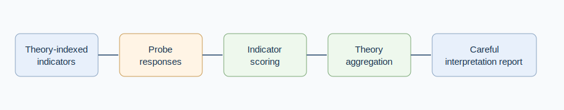

# Chetana: A Theory-Indexed Probe Framework for AI Consciousness Indicator Scoring

Mukunda Rao Katta

## Abstract

Claims about AI consciousness are easy to overstate and difficult to evaluate. This paper presents Chetana, a theory-indexed probe framework that maps model responses to a set of consciousness indicators drawn from Global Workspace Theory, Higher-Order Theories, Recurrent Processing Theory, Predictive Processing, and Attention Schema Theory. The implementation organizes indicators, probes, model adapters, scoring, theory aggregation, probability calculation, and report generation in a TypeScript monorepo. The goal is not to determine whether an AI system is conscious. It is to make a narrow evaluation workflow inspectable: which theory supplied each indicator, which probe produced each observation, how indicator scores were aggregated, and how uncertainty should be reported. The framework is positioned as research tooling for careful discussion, not as a consciousness detector.

## 1. Motivation

Recent discussion about AI consciousness has made one thing clear: the subject needs careful language. A checklist cannot settle whether a system has subjective experience. It can, however, make a discussion more concrete by separating indicators, probes, scores, and interpretation. Butlin and colleagues propose drawing insights from the science of consciousness while avoiding simplistic conclusions about current systems [@butlin2023consciousness].

Chetana follows that spirit. It treats consciousness theories as sources of indicators rather than as final verdict machines.

## 2. Repository Basis

The implementation is a TypeScript monorepo with four relevant packages.

- `@chetana/shared` defines theories, indicators, weights, and schemas.
- `@chetana/probes` defines probe material organized by theory.
- `@chetana/models` provides model adapters.
- `@chetana/scorer` aggregates indicator scores, theory scores, probability estimates, and reports.

The public README describes 14 indicators across Global Workspace Theory, Integrated Information Theory, Higher-Order Theories, Recurrent Processing Theory, Predictive Processing, and Attention Schema Theory. The code separates scoring from interpretation, which is important for a topic where overclaiming would be easy.

*Figure 1. Chetana workflow from theory-indexed indicators to an interpretation report.*

## 3. Method

The framework starts from theory-indexed indicators. Probe responses are scored at the indicator level. Indicator scores are then aggregated into theory-level summaries using explicit weights. The output is a structured report rather than a binary label.

This separation matters. A low score for one probe should not be treated as a broad conclusion about a model. A high score should not be treated as proof of consciousness. The useful output is the map: which indicators were tested, what evidence was observed, and where uncertainty remains.

## 4. Review Dimensions

| Dimension | What it checks | Example output | Why it matters |
| --- | --- | --- | --- |
| Theory traceability | Which theory supplied each indicator | GWT, HOT, PP, AST | avoids ungrounded labels |
| Probe coverage | Which indicators were actually tested | probe count per indicator | exposes missing evidence |
| Aggregation clarity | How scores roll up by theory | weighted theory scores | makes assumptions visible |
| Model adapter separation | Which model produced responses | OpenAI, Anthropic, Google, Ollama | supports comparison |
| Interpretation caution | Whether reports avoid overclaiming | probability estimate plus caveat | keeps the output responsible |

## 5. Limits

The framework does not measure subjective experience. It cannot validate first-person consciousness, and it should not be used as a certification tool. It also depends on judge-model scoring or heuristic scoring, both of which can introduce bias. The appropriate use is exploratory: comparing model responses under structured probes and keeping the interpretation modest.

## 6. Conclusion

Chetana is best understood as research scaffolding. It turns a difficult philosophical and scientific topic into a more inspectable evaluation workflow without pretending the workflow answers the whole question. Its contribution is the organization of theory, probes, scoring, aggregation, and reporting into a structure that can be tested and criticized.

## References

References are provided in `paper.bib`.

